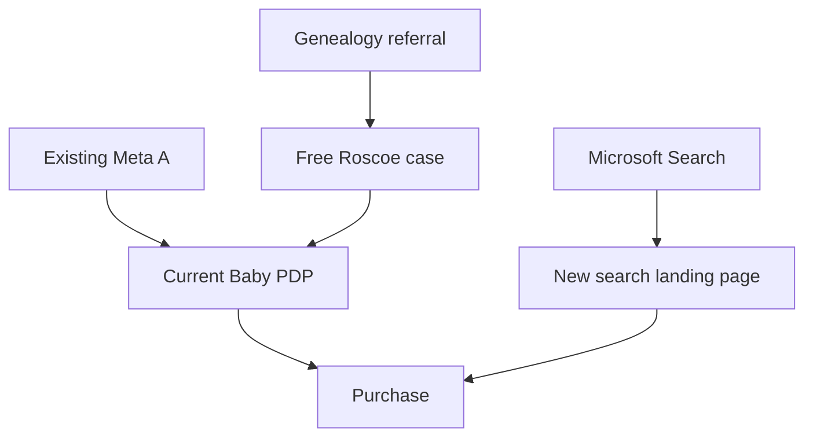

# PP-AUDIENCE-CHANNEL-EXEC-001 — qualified-audience acquisition sprint

**Owner:** Owner_Bot — Porch Press (ChatGPT)  
**Executor:** existing Shopify_Bot / Shopify_Store_Designer, routed by Connector_Bot  
**Start:** 2026-09-10, America/Chicago  
**Hero offer:** *Baby in a Basket* — $19.99 USD  
**Primary business outcome:** one new, non-test, full-price purchase attributable to this sprint  
**Incremental spend authorized:** no more than $15 USD in Microsoft Advertising; no other new spend

## 1. Decision and operating thesis

This sprint tests two qualified paths without disturbing the live Meta treatment:

1. **Purchase intent:** a person searches for a printable genealogy mystery and lands on a dedicated, message-matched Baby page.
2. **Borrowed trust:** a genealogy society, educator, or newsletter sends people to the existing free Roscoe investigation, which can lead them to Baby.

The existing Meta path remains a separate control-like observation cell. This is not a randomized A/B test. Channel, audience, and landing experience change together, so results support only a decision about each complete path.

### Why this order

- Paid commitment is a cleaner segment than a generic “affluent” label: American Ancestors currently sells annual memberships and genealogy institutes sell multi-day instruction. These facts establish willingness to spend on the hobby, not guaranteed demand for this product.
- Genealogy educators, societies, and webinar systems concentrate people who already enjoy interpreting records. They supply borrowed trust for an unfamiliar product format.
- Search captures an explicit problem or product query and is the only new paid channel in this sprint.
- Large public communities are useful for customer language but often prohibit commercial solicitation; they are not assigned as posting surfaces.

Evidence sources:

- `https://www.americanancestors.org/join`
- `https://ighr.gagensociety.org/`
- `https://conferencekeeper.org/wp-content/uploads/2026/04/Advertising-Rate-Sheet-02-2026-1.pdf`
- `https://www.reddit.com/r/Genealogy/`
- `https://www.familysearch.org/en/legal/terms`

## 2. Facts, decisions, assumptions, and open items

### Facts to preserve

- All eight active Shopify mysteries are currently $19.99.
- Baby is the paid hero.
- The live Baby PDP already has three media items, a structured description, clear digital-delivery language, progressive hints, and a complete solution.
- Current Meta state reported in issue #5: `PP-BABY-ADS-001`; Aud1 ad set `120249380231350482` active; creative A `120249380231340482` on; creative B off; former broad ad set paused.
- The current Meta audience is reported as US women 28–50 with Parents, Genealogy, Homeowner association, and Frequent Travelers signals; Meta still labels the section Advantage+.
- Eleanor Hart's primary cover was reported to retain a stale `$9.99` price.
- Microsoft Ads authentication remains unresolved. The campaign is not known to be live and $0 of the new $15 authorization is recorded as spent.

### Decisions

- Do not edit the existing Baby PDP, current Meta destination, Meta creative, Meta audience, Meta budget, or Meta end date in this task.
- Build a separate search landing page so the current Meta path remains interpretable.
- Use Baby's verified product facts and existing spoiler-free assets only.
- Use the existing complete, ungated Roscoe browser investigation as the referral demonstration. Do not create another free case.
- Do not rename any Shopify product in this sprint.
- Do not discount the $19.99 offer.

### Assumptions to verify, not silently accept

- The active theme can render a page-specific product form for variant `52494545486122` without an app.
- Shopify acquisition reporting preserves the initial UTM through an internal free-case-to-Baby journey.
- The Microsoft account can enforce a genuine $15 total-spend limit. A daily budget alone is not assumed to be a hard cap.

### Open items

- Actual current Meta cumulative spend and post-change Baby funnel counts.
- Microsoft authentication and available hard-cap mechanism.
- Whether Grok has authenticated Etsy, Pinterest, or outbound-email access. Those channels are excluded from this sprint rather than assumed.

## 3. Hard boundaries

- No spend outside the separately authorized Microsoft Advertising maximum of **$15 total**.
- Do not raise, extend, duplicate, pause, or otherwise mutate the current Meta campaign in this task.
- Do not install or buy an app, subscription, domain, list, or creative tool.
- Do not open, publish, or advertise an Etsy or Pinterest presence in this sprint. Those are later tests, not substitutes for the two paths defined here.
- Do not add to cart, enter checkout, or create a test order during verification.
- Do not change product price, handle, delivery mapping, customer ZIPs, story, evidence, hints, solution, or canon.
- Do not invent reviews, buyers, playtime, difficulty, urgency, scarcity, a guarantee, or claims that the fictional records are real.
- Do not send email, DM anyone, submit an event, post in a group, promise an affiliate rate, or provide a paid case for free. Prepare those items and return them for release.
- Do not market inside Reddit, FamilySearch, NGS member forums, or Facebook groups without explicit administrator permission.
- All new public copy in this file is Owner_Bot-authored. Grok may implement and visually design it but may not rewrite or embellish it.

## 4. Execution sequence

### Workstream A — establish a clean starting line

Do this before any mutation.

1. Record the current time in America/Chicago.
2. Export or capture, separately for the current Meta ad set/ad and Shopify Baby page:
   - spend;
   - impressions;
   - outbound/link clicks;
   - measured landing-page views;
   - qualified Baby PDP sessions;
   - add-to-carts;
   - checkout starts;
   - purchases;
   - source, campaign, and content UTMs where available.
3. Exclude known owner, bot, admin, QA, free, and test-order activity. Preserve unknown attribution as unknown.
4. Record the exact current Meta budget and scheduled end. Make no Meta change.
5. Inspect all eight live product cards, primary product media, descriptions, and SEO snippets for a visible `$9.99` or other price inconsistent with the live $19.99 price.

**Allowed repair:** remove a stale `$9.99` overlay or text and replace it with the same art/text treatment without any price. The reported Eleanor Hart cover defect is in scope. Preserve title, image composition, product media order, alt meaning, handle, and delivery. Back up before replacing.

**Receipt:** `BASELINE + PRICE-INTEGRITY RESULT` with timestamp, counts, current Meta cap/end, every stale-price location found, exact changes, before/after screenshots, and files/theme sections affected.

### Workstream B — build the search-specific Baby landing page

Create a separate, unlisted campaign page at:

`https://porchpress.store/pages/genealogy-mystery-case`

Do not replace or redirect the canonical Baby PDP. Add `noindex,follow` if the theme supports page-specific robots metadata without affecting other pages.

#### Required above-the-fold copy

**Eyebrow**  
`A complete printable genealogy mystery`

**H1**  
`The Answer Is in the Records.`

**Product title**  
`Baby in a Basket`

**Lead**  
`A baby was left in a basket. Compare census entries, birth records, and household clues to determine who she was before Sutton.`

**Facts**

- `36-page player case`
- `20 fictional exhibits`
- `6 deductions`
- `Progressive hints and a sealed solution`
- `Play solo or together`

**Primary CTA**  
`Open the Case — $19.99`

**CTA support**  
`Printable PDFs emailed after checkout. Nothing ships.`

**Trust line**  
`One complete case. Every clue included. No host. No outside research.`

#### Required remainder of page

**Section heading:** `See the evidence before you buy`  
Use only the existing spoiler-free Baby opening-story and census-preview images. Keep the current conceptual cover clearly separate from playable evidence. Add the existing `Preview 3 spoiler-free pages` link.

**Section heading:** `How the investigation works`

1. `Read the case and examine the records.`
2. `Compare four possible identities and complete six deductions.`
3. `Use progressive hints if needed, then open the sealed solution.`

**Section heading:** `What you receive`

- `36-page player packet with the story, records, and working pages`
- `5 pages of progressive hints`
- `8-page sealed solution`
- `START-HERE instructions`
- `Optional 52-page combined printing file`

`Use the separate PDFs or the optional combined printing file—not both.`

**Section heading:** `Know exactly what this is`

`Baby in a Basket is a fictional genealogy mystery using newly designed, fictional period-style records. It is a digital product, not a physical box, genealogy service, or unsolved real case.`

Repeat the same live product form once at the bottom. Do not create competing CTAs, navigation detours, an email gate, pop-up, countdown, sticky bar, discount, or cross-sell.

#### Product-form and design requirements

- Render the actual live Baby product/variant and price; do not create a duplicate SKU.
- Fix quantity at one and preserve existing cart/fulfillment behavior.
- If supported by the existing theme without an app, include private line-item property `_pp_entry=search_lp_v1`. If unsupported, report it and rely on UTMs.
- Desktop order: copy, facts, live price, and purchase control in the left column; cover and the two spoiler-free preview thumbnails in the right column.
- Mobile order: eyebrow, H1, lead, cover, live price and purchase control, trust line, then preview thumbnails and the remaining page. Do not lead with a full-screen decorative image.
- Visual style: restrained archival dossier, warm paper, strong contrast, minimal ornament. The actual preview pages—not decorative props—must carry the proof.
- Maintain accessible heading order, keyboard focus, alt text, and no horizontal overflow.
- Preserve a rollback copy of every theme/page asset touched.

#### Landing-page verification

Verify without clicking the purchase controls:

- public 200 response;
- desktop and 390 × 844 screenshots;
- H1, Baby title, live $19.99 price, digital delivery, and purchase control visible and legible;
- the product form targets variant `52494545486122` and quantity one by DOM inspection;
- both spoiler-free images and the three-page preview link load;
- no unintended `$9.99` appears;
- no console error introduced;
- UTMs remain in the address bar on load;
- canonical Baby PDP and current Meta URL remain unchanged and working.

**Receipt:** `LANDING PAGE LIVE` or `BLOCKED`, with public URL, theme/page identifiers, backup paths, screenshots, computed mobile type sizes, form/variant evidence, asset source paths, and exact blocker if any.

### Workstream C — stage and run the authorized Microsoft Search test

The complete campaign specification is in:

`marketing/Baby-in-a-Basket/PP-BING-ADS-001/EXECUTION.md`

Build one Search campaign only. Use the new landing page as the Final URL, replacing the older PDP destination while preserving all other campaign rules. Final URL:

`https://porchpress.store/pages/genealogy-mystery-case`

Required campaign identity:

- Campaign: `PP-BING-ADS-001`
- Ad group: `AG1_GENEALOGY_INTENT`
- Exact and phrase keywords only
- Microsoft owned-and-operated Search only
- Search partners and Audience Network excluded
- AI expansion, final URL expansion, auto-generated creative, and auto-apply recommendations off where exposed
- Maximum CPC: $1.00
- Total authorized Microsoft spend: **$15 USD maximum, not $15/day**
- UTM campaign: `pp_bing_ads_001`

Build paused while authentication or spend-cap enforcement is unresolved. Once authentication works, the landing page passes, conversion attribution is visible, and a true $15 maximum is verified, this existing $15 authorization permits activation without another budget request. If the account cannot enforce a true $15 maximum, do not activate and return `BLOCKED — NO HARD CAP`.

Stop immediately for the first of:

- total Microsoft spend reaches $15;
- broken landing page, wrong price, wrong network, or missing UTM;
- one attributed purchase;
- at least eight attributed landing sessions with zero add-to-carts;
- campaign/ad-group end date.

One purchase is a directional commercial signal, not proof of repeatability. Fewer than five clicks is inconclusive. Preserve actual search terms before changing keywords or copy.

**Receipts:** `BING STAGED`, then `BING LIVE` or a precise blocker. Final report must show campaign/ad-group/ad IDs, account currency/time zone, cap mechanism, settings, preview, timestamps, spend, queries, clicks, landings, funnel events, and orders.

### Workstream D — prepare the genealogy trust-channel pilot

Create:

`marketing/partnerships/PP-GENEALOGY-PARTNER-PILOT-001.md`

Build a researched list of **15 organizations**, not 100 generic leads:

- five active local/state genealogy societies with public program or newsletter contacts;
- five active genealogy educators, YouTube channels, podcasts, or newsletters with public collaboration/review routes;
- five calendars, libraries, institutes, or continuing-education programs that accept genealogy resources or program proposals.

Seed sources:

- ConferenceKeeper event submissions: `https://conferencekeeper.org/event-submissions/`
- NGS society directory: `https://ngsmembers.ngsgenealogy.org/Societies-and-Organizations-Directory2`
- Legacy Family Tree Webinars: `https://familytreewebinars.com/`
- Ohio Genealogical Society events/chapters: `https://www.ogs.org/events/`
- California Genealogical Society: `https://www.californiaancestors.org/`
- Allen County Public Library Genealogy Center: `https://www.acpl.lib.in.us/genealogy`
- OLLI course proposals: `https://olli.lifelonglearning.ncsu.edu/teach-for-olli/`

Each row must contain: organization, public source URL, audience-fit reason, recent-activity evidence, public contact/submission route, promotion/program rule, recommended ask, proposed tracked link, and status. Exclude scraped personal addresses, inactive sites, groups that forbid promotion, adoption/unknown-parentage support communities, and any route that requires pretending to be a member.

#### Approved draft for societies/newsletters

**Subject:** `A free records-based mystery for your genealogy members`

`Hello [Name],`

`Porch Press creates fictional mysteries that family-history researchers solve by comparing census entries, certificates, and conflicting household records.`

`We have made Roscoe's Grave—a complete, ungated browser investigation—available free. It gives researchers an evidence trail to examine without creating an account or researching a real family.`

`Would you consider reviewing it for your member newsletter, resource page, or a future case-night program? Here is the preview link: [tracked link]. Any mention of our paid cases would be clearly separate and included only if your rules permit it.`

`Thank you,`  
`PM`  
`Porch Press`  
`https://porchpress.store`

#### Approved draft for educators/reviewers

**Subject:** `Review copy: a genealogy mystery solved from the records`

`Hello [Name],`

`Porch Press makes fictional printable mysteries for people who enjoy solving family-history questions from documentary evidence.`

`Our current case, Baby in a Basket, asks players to compare 20 fictional exhibits and determine who a foundling was before she became Mabel Sutton. It includes six deductions, progressive hints, and a sealed solution.`

`I am preparing a small reviewer group and thought your audience might recognize immediately what makes the format different. Would you be interested in examining a review copy? There is no requirement to cover it, and any review would remain entirely yours.`

`Thank you,`  
`PM`  
`Porch Press`  
`https://porchpress.store/products/baby-in-a-basket`

Do not send either message. Return the completed 15-target sheet and the five highest-fit recommendations for release. Do not fabricate audience sizes or contact permissions. Do not promise money, affiliate commission, exclusivity, a live presentation, or free paid-case licenses beyond the drafted invitation to examine a review copy.

**Receipt:** `PARTNER PILOT READY` with the committed file path, five recommended first contacts, evidence, exact tracked URLs, and any access needed to send.

## 5. Measurement map

| Path | Landing | Stable ID | Primary outcome | Secondary evidence |
| --- | --- | --- | --- | --- |
| Existing Meta | Current Baby PDP | `utm_campaign=pp_baby_ads_001` + existing content ID | Attributed $19.99 purchase | qualified sessions, ATC, checkout |
| Microsoft Search | New search page | `utm_campaign=pp_bing_ads_001` | Attributed $19.99 purchase | search term, click, landing, ATC, checkout |
| Partner/referral | Existing free Roscoe page | `utm_campaign=pp_genealogy_partner_001` + unique source slug | Attributed $19.99 purchase | free-page sessions, Baby click-through, ATC, checkout |

Use only lowercase ASCII partner slugs. No personal information in URLs. One example:

`https://porchpress.store/pages/free-investigation?utm_source=example_society&utm_medium=referral&utm_campaign=pp_genealogy_partner_001&utm_content=free_roscoe`

Confirm the actual free-investigation handle before generating final links. Do not invent it from this example.

A **qualified landing session** is a human, non-owner, non-admin session that loads the intended landing page and carries the applicable campaign/referral identifier. A click without a measured page load is not a landing. Preserve missing or ambiguous attribution instead of assigning it to a channel.

At 24, 48, and 72 hours after a path becomes live, report compatible incremental counts from that path's timestamped baseline. Do not sum overlapping windows or merge test/bot traffic.

## 6. Decision rules

| Evidence | Decision |
| --- | --- |
| One attributable full-price purchase from a new path | Directional positive. Preserve the exact path and stop its paid spend for Owner review. |
| Search receives ≥8 qualified landings and 0 ATC | Stop at once. Query/page/price package failed the operational threshold; do not broaden keywords. |
| Search receives ATC or checkout but no purchase by $15 | Preserve evidence and inspect completion friction before changing the promise. |
| Search receives <5 clicks by the end | Inconclusive; do not call the audience uninterested. |
| Existing Meta reaches 25 qualified post-baseline Baby landings with 0 ATC | Report the threshold; do not mutate or pause Meta under this task. Request a separate decision. |
| Partner list is completed but no outreach is released | Preparation complete, market evidence still zero. Do not claim demand. |
| Partner outreach later produces a placement but no sales | Report reach/landings and continue only if the zero-cash placement remains useful; a placement is not product validation. |

## 7. Required Grok response protocol

1. Reply once with `ACK PP-AUDIENCE-CHANNEL-EXEC-001`, the exact commit read, the Bot owning each workstream, and the starting action.
2. Post one consolidated board with statuses: `NOT STARTED`, `IN PROGRESS`, `STAGED`, `LIVE`, `BLOCKED`, or `COMPLETE`.
3. Return evidence, not narration. A status post is not a completion receipt.
4. Do not duplicate existing PP-BABY-ADS-001, PP-BABY-PDP-PROOF-002, or older growth work.
5. If an operation fails twice, stop repeating it; preserve the last working state and return the precise blocker and next supported route.
6. Final response must reconcile actual spend, orders, attribution, files changed, live URLs, held work, and the single recommended next decision.

## 8. Definition of done

This assignment is complete when:

- the baseline and live price-integrity sweep are evidenced;
- the separate search landing page is live and verified without disturbing the existing Meta/PDP path;
- the Microsoft campaign is either safely live under the $15 cap or precisely blocked after being fully staged;
- the 15-target partner pilot and exact drafts are committed but not sent;
- results and spend are reconciled without counting tests or unknown traffic as buyers;
- Grok returns one next decision rather than expanding the plan.
